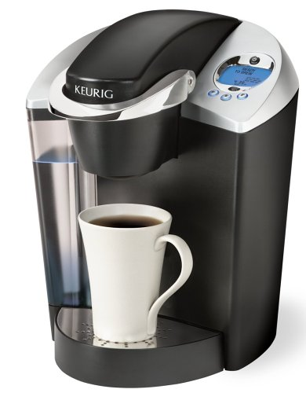

# Coffee

Makes 1 cup
##Ingredients
* 1 Kuerig dark-roast coffee pod
* splash of soy milk
* 1 packet of "sugar in the raw" sugar

##Directions
1. Ensure that the Kuerig has enough water to make a cup by lifting up the lid and pouring water into the container on the left side of the container
1. Lift the handle in the middle and place the coffee pod in the hole. Pull the handle back down and secure it.
1. While the machine is warming up, place your coffee cup under the nozzle. 
1. The machine will start blinking when it has reached required temperature. Push one of flashing buttons depending on the amount of coffee you prefer.
1. When the machine is done brewing (typically takes 30 seconds) carefully pick coffee cup up off the platform. 
1. Pour sugar packet and add the splash of soy milk and stir.
